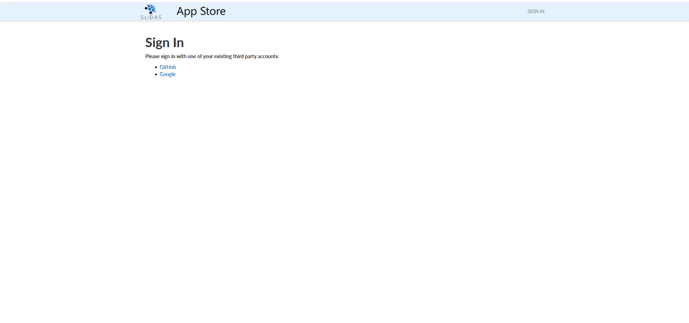
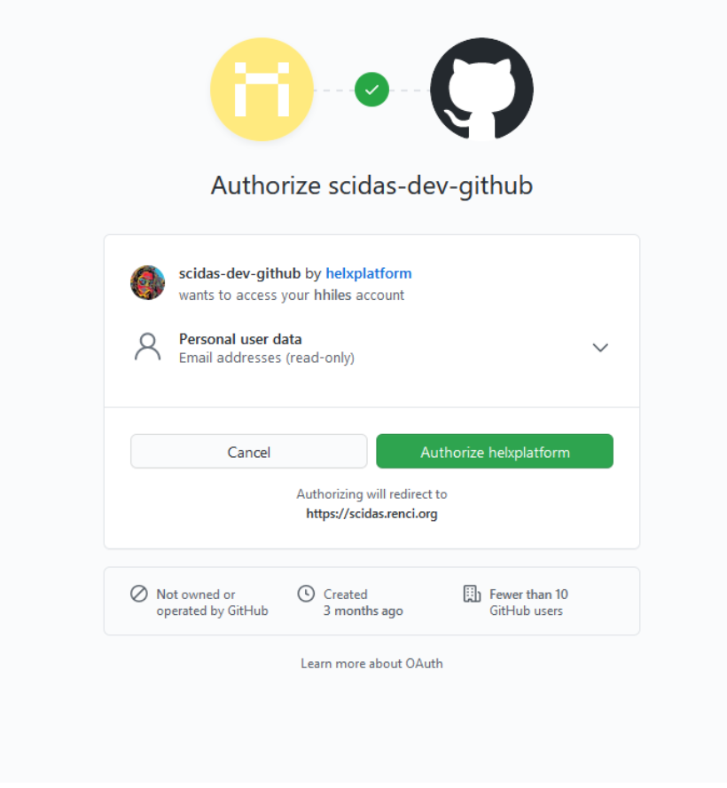
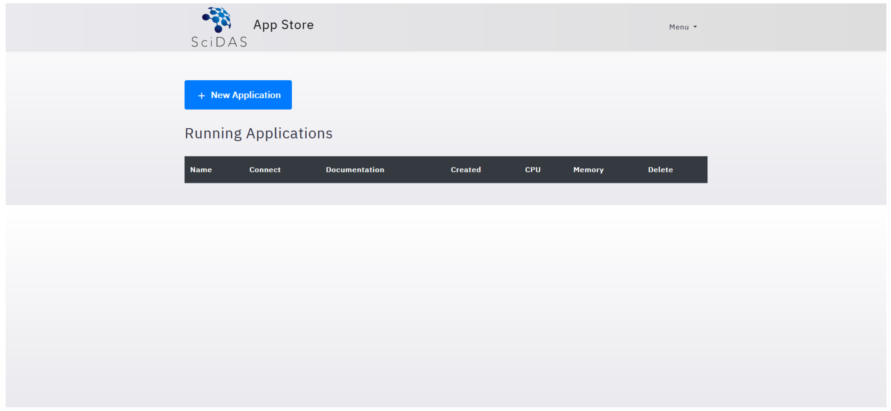

#######################
Creating an Application
#######################

*The instance of HeLx you start with will vary. This tutorial shows
starting an app from the SciDAS instance, but instructions are the same
regardless of how you want to start an App using HeLx.*

=========================
Log in and Start your App
=========================

**Step-1:** Begin by navigating to your team's instance of HeLx and signing
in using either GitHub or Google.

    
**Step-2:** Log in to HeLx.

   
**Step-3:** Select "New Application" to choose the App you wish to run.

    
    .. image:: images/create-4.png
    :align: center
    :alt: ceating an application
   
   
**Step-4:** Once you have launched your App, use the following guides for
instructions on launching the following Existing Apps:

- Blackbalsam, 
- CloudTop, 
- DICOM Viewer for Google Health API, 
- ImageJ-Napari, 
- Jupyter-DataScience, 
- Nextflow API, and 
- Rstudio
